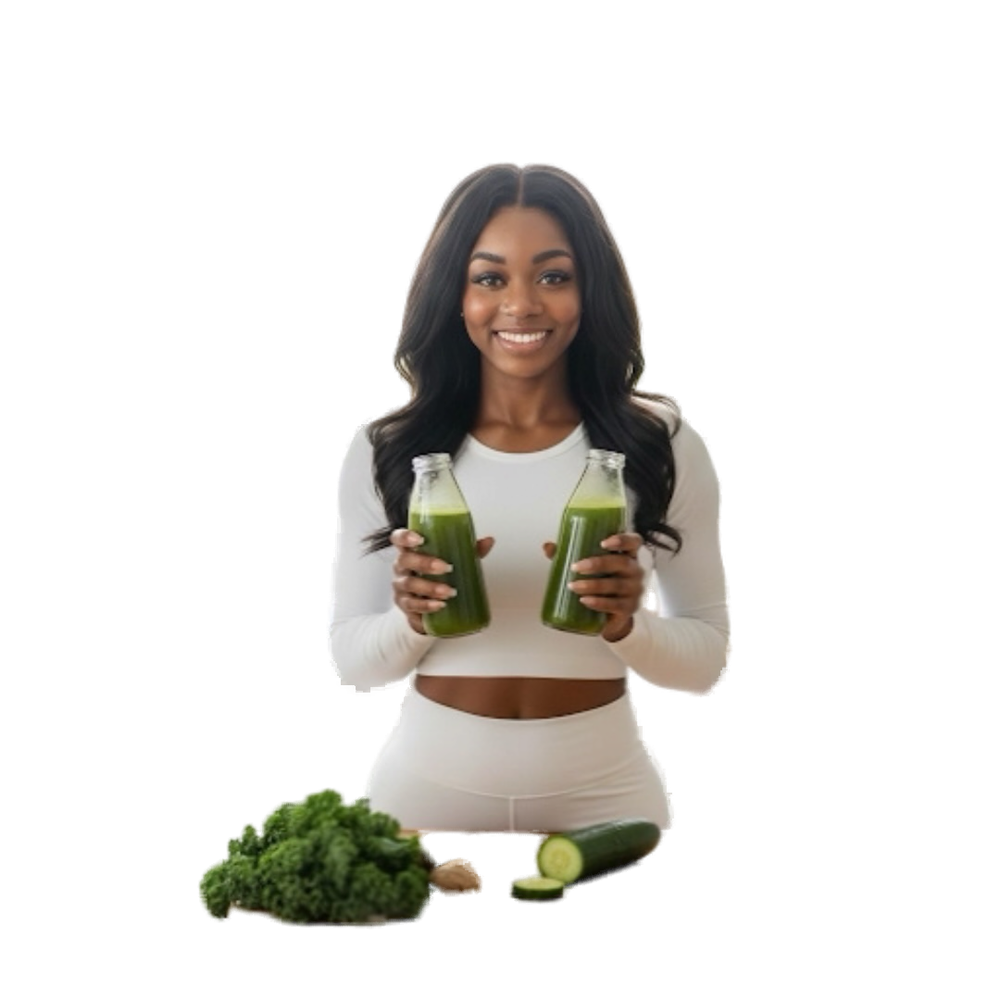

<p align="center">
  
</p>

<h1 align="center">Liana Hanelle</h1>

<p align="center">
  <strong>Soul. Spirit. Alignment.</strong><br>
  The official website of Liana Hanelle (<a href="https://instagram.com/lianahanelle">@lianahanelle</a>)
</p>

<p align="center">
  <a href="https://instagram.com/lianahanelle">Instagram</a> &nbsp;&middot;&nbsp;
  <a href="https://www.lianahanelle.com/">Website</a> &nbsp;&middot;&nbsp;
  <a href="https://tiktok.com/@lianahanelle">TikTok</a> &nbsp;&middot;&nbsp;
  <a href="https://linktr.ee/lianahanelle">Linktree</a>
</p>

---

## About

Liana Hanelle is a Relational Intelligence Coach, Spiritual Director, and Certified Holistic Health Practitioner helping women break toxic cycles, deepen their relationship with God, and transform their lives — emotionally, spiritually, and holistically. Through her signature 8-Week Relationship Detox Program and personalized sessions, she guides women through intentional healing and deep spiritual reconnection.

This is her official website — a premium, single-page experience featuring her coaching services, wellness offerings, social links, and an immersive ambient soundtrack.

## Features

- Dark luxury aesthetic with emerald green/coral accents and smooth scroll-reveal animations
- Looping ambient soundtrack with mute toggle (plays after the branded loading screen)
- Responsive design optimized for mobile, tablet, and desktop
- Curated service hub for coaching, wellness sessions, and spiritual direction
- Custom cursor effects on desktop
- Lightweight — zero frameworks, pure HTML/CSS/JS served by Express

## Getting Started

### Prerequisites

- [Node.js](https://nodejs.org/) v16 or newer

### Install & Run

```bash
npm install
npm start
```

The site will be live at **http://localhost:31003**. Set the `PORT` environment variable to change it.

## Project Structure

```
.
├── server.js              # Express server (serves public/)
├── package.json
├── public/
│   ├── index.html         # Main page — all text and links live here
│   ├── styles.css         # All styling
│   ├── script.js          # Animations, music control, interactions
│   ├── favicon.svg        # Leaf favicon
│   ├── audio/             # Background music (.mp3)
│   └── images/            # Hero cutout, about photo, OG image
```

## How to Update Content

All visible text and links are in **`public/index.html`**. Open that single file to change anything.

### Updating Links

Every external link is a standard `<a href="...">` tag. Search for the current URL and replace it:

| What | Search for | Section |
|---|---|---|
| Instagram | `instagram.com/lianahanelle` | Explore, About, Connect, Mobile Menu, Footer |
| TikTok | `tiktok.com/@lianahanelle` | Explore, Connect, Mobile Menu, Footer |
| Website | `lianahanelle.com` | Explore, About, Connect, Mobile Menu, Footer |
| Relational Intelligence | `services-store/p/basic-service-dar7y` | Explore |
| Nutrition & Wellness | `services-store/p/intermediate-service-gw3f3` | Explore |
| Spiritual Direction | `services-store/p/advanced-service-n28cl` | Explore |
| All Resources | `linktr.ee/lianahanelle` | Explore |

### Updating Text

Key text locations in `index.html`:

| Content | Where to look |
|---|---|
| Page title & SEO | `<title>` and `<meta>` tags in `<head>` |
| Hero headline | `<span class="hero__line">` elements |
| Hero tagline | `<p class="hero__tagline">` |
| Stats (17K, 4+) | `data-count` attributes on `.hero__stat-number` |
| About bio | `<div class="about__bio">` paragraphs |
| Section titles | `<h2 class="section__title">` elements |
| Link card titles & descriptions | `.link-card__title` and `.link-card__desc` |
| Footer tagline | `.footer__copy` |
| Quote-break text | `.quote-break__content p` |

### Swapping Images

Replace files in `public/images/` with new ones **using the same filenames**. Recommended sizes:

| Image | Recommended |
|---|---|
| `hero-cutout.png` | 900px wide, transparent PNG |
| `lianahanelle-9.jpg` (about) | 800x1000+ (portrait) |
| `og-image.png` | 1280x720 |

### Changing the Music

Replace `public/audio/holistic-harmony.mp3` with a new `.mp3` file. If the filename changes, update the `<source src="...">` in `index.html`.

## Ready-Made Prompts

Copy-paste these into Cursor or any AI assistant to quickly update the site:

---

**Update the About section bio:**
> Open `public/index.html`. In the About section (look for `<div class="about__bio">`), rewrite the three paragraphs to say: [YOUR NEW BIO HERE]. Keep the same HTML structure — three `<p class="reveal">` tags with the last one being a short punchy tagline. Keep the 8-Week Relationship Detox Program mention in italics with the `<em>` tag.

---

**Add a new link card to the Explore section:**
> Open `public/index.html`. In the Explore section (look for `<div class="explore__grid">`), add a new link card after the last one. Use this as the template: URL is [URL], title is [TITLE], description is [DESCRIPTION]. Use the Font Awesome icon class `[ICON CLASS]`. Match the existing `link-card` structure exactly.

---

**Update an existing link URL:**
> Open `public/index.html`. Find every instance of `[OLD URL]` and replace it with `[NEW URL]`. This link appears in multiple sections so make sure to replace all occurrences.

---

**Change the hero stats:**
> Open `public/index.html`. In the hero section, find the `.hero__stat-number` spans. Change `data-count="17000"` to `data-count="[NUMBER]"` and update the suffix/label if needed. Do the same for the other stats.

---

**Swap out the background music:**
> Replace the file at `public/audio/holistic-harmony.mp3` with the new `.mp3` file. If the filename is different, open `public/index.html` and update the `<source src="audio/...">` inside the `<audio id="theme-song">` element.

---

**Add a new social platform to Connect:**
> Open `public/index.html`. In the Connect section (look for `<div class="connect__grid">`), add a new connect card. Also add the same link to the mobile menu socials (`<div class="mobile-menu__socials">`) and the footer socials (`<div class="footer__socials">`). Use the Font Awesome icon for the platform.

---

**Change the page title and SEO metadata:**
> Open `public/index.html`. Update the `<title>` tag and the `<meta name="description">`, `<meta property="og:title">`, `<meta property="og:description">`, and `<meta property="og:image">` tags in the `<head>` section.

---

**Update the signature quote:**
> Open `public/index.html`. Find the quote-break section (look for `<section class="quote-break">`). Update the text inside the `<p>` tag within `.quote-break__content`. Keep it lowercase for the design style.

---

## License

All rights reserved. This site and its contents are the property of Liana Hanelle.
